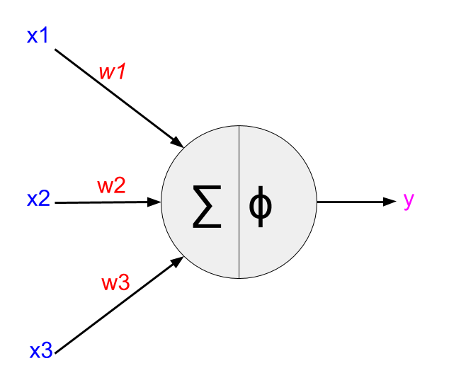
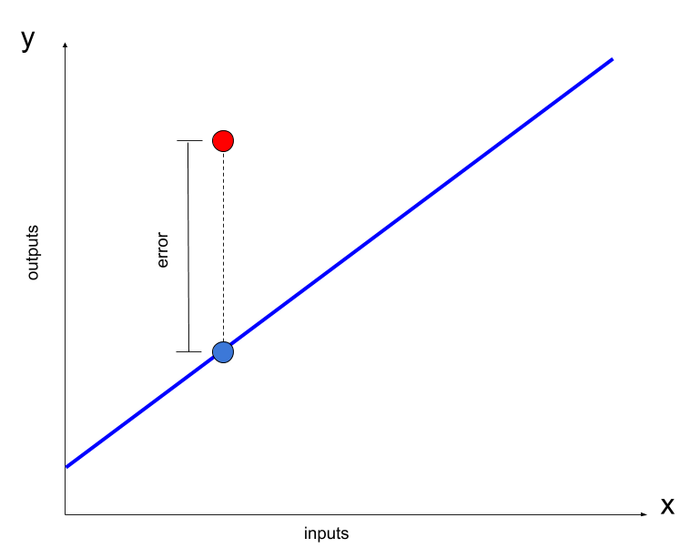

# Perceptron

Understanding neural networks with code and no machine learning libraries.
Making predictions with a perceptron. A perceptron is a single neuron in a neural network. In this example, in order to train the perceptron to make accurate prediction, we require a set of inputs, each with an assoicated output (label).
## Requirements

- numpy (`pip install numpy`)

## Creating the Neuron

The perceptron as described above requires inputs, labeled outputs and weights.
Eg.
```
Input: X = [x1,x2,x3,...,xn]
Output (label): y_label
```

A perceptron consists of a set of weights to 'map' the input (X) to the output y. Initially the weights are all randomly initialised. Generally according to a gaussian around a mean of 0.
```
Weights: W = [w1,w2,w3,...wn]
```
This is computed using the dot product of the inputs X with the weights W. The dot product is computed as follows:
```
y' = x1*w1+x2*w2+x3*w3+...+xn*wn
```
In order to produce non-linear functions an activation function is chosen. There are three main activation functions: Sigmoid, ReLu and tanH. There certain benefits to using each one. The output (`y`) is calculated by applying the activation function to `y'`.
```
y = 1 / (1 + exp(-y'))
```
The below image shows a simple diagram of the "Feed forward" component described above for an input vector size of 3. Note the number of inputs matches the number of weights for the perceptron.



## Backpropagation
The error associated with the prediction of the perceptron is calculated by comparying the predicted output `y` to the actual label `y_label`.
```
error = y_label - y
```
The figure belows shows the predicted output (red circle) compared to the actual value (blue circle). The blue line represents the function we want the neural network to model. Therefore given an input we would like our perceptron to find a value associated with y value which is close to the associated y value on the line.



The idea is to minimise the error by updating the weights. The weights are updated according to the following formula:
```
W_new = W_old + X * error * deriv_activation(output)
```
The derivate of the activation function is used as it is the gradent of the error with respect to the weights. The activation functions such as ReLu, Sigmoid and tanH all have derivatives which only rely on the output value. (more details to follow)
The input X, error and deriv_activation(output) in the above weight update equation is used to push the Weights in the correct direction. My view is the input X is used as it affects the strength of the error and since it is a dot product with the weights, the input value affects the strength of the affect on the error.

The process of updating the weights with the above weight update equation is a simple example of backpropagation

## Training

Training requires a set of inputs each with an assoicated true output. Process of training involves:
1. Forward pass
2. Backpropagate
3. Update weights
4. Repeat 1-3 for a number of epochs
